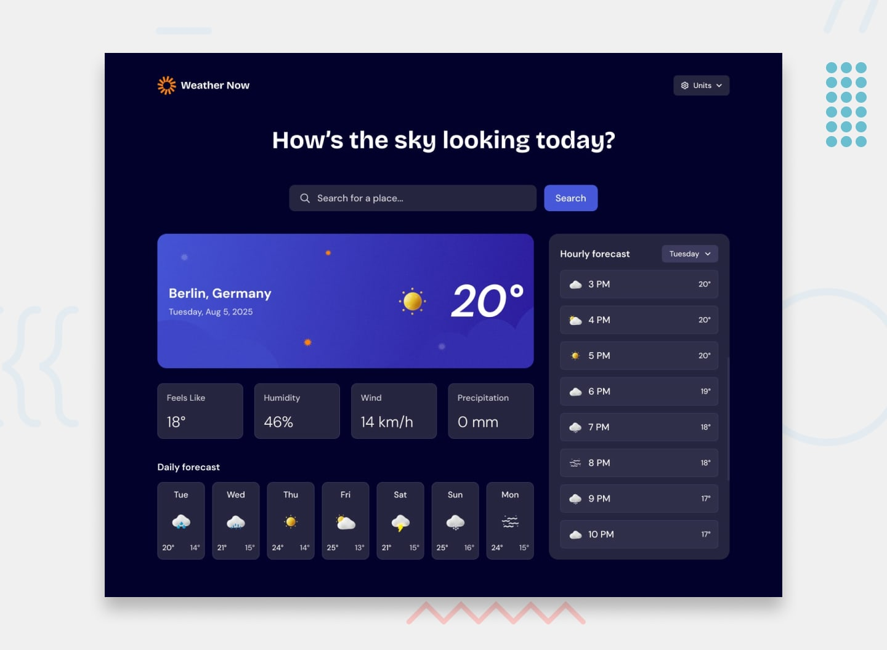

# Frontend Mentor - Weather App Solution

This is a solution to the [Weather app challenge on Frontend Mentor](https://www.frontendmentor.io/challenges/weather-app-K1FhddVm49). Frontend Mentor challenges help you sharpen your front-end coding skills by building realistic, accessible projects.

## Table of Contents

- [Overview](#overview)
  - [The Challenge](#the-challenge)
  - [Screenshot](#screenshot)
  - [Links](#links)
- [My Process](#my-process)
  - [Built With](#built-with)
  - [What I Learned](#what-i-learned)
  - [Continued Development](#continued-development)
  - [Useful Resources](#useful-resources)
- [Author](#author)
- [Acknowledgments](#acknowledgments)

---

## Overview

### The Challenge

Users should be able to:

- Search for current weather and future forecasts by entering a location name.
- View real-time weather metrics including temperature, descriptive conditions, dynamic icons, humidity, and wind speed.
- View forecast data organized across structured daily or hourly displays.
- Enjoy an intuitive, responsive interface optimized for mobile, tablet, and desktop viewports.
- Receive informative, non-intrusive feedback when inputting invalid locations or encountering network/server errors.
- See clear hover, focus, and active states across all interactive controls.

### Screenshot



### Links

- **Live Demo (Vercel):** https://weather-application-henna-rho.vercel.app/

- **GitHub Repository:** https://github.com/atul-kumar06/weather-application

---

## My Process

### Built With

- **Semantic HTML5 markup** - For accessible document flow and screen-reader friendliness.
- **CSS3 Variables** - For clean theme management, standardized spacing scales, and color schemes.
- **CSS Flexbox** - Handled single-dimensional layouts, card headers, and responsive search bars.
- **CSS Grid** - Built multi-column metrics and responsive forecast card grids.
- **Vanilla JavaScript (ES6+)** - Managed state, network requests, and real-time DOM updates.
- **Fetch API & Asynchronous JavaScript** - Handled remote calls using `async` / `await`.
- **Weather API** - Integrated real-time forecasting data (e.g., Open-Meteo or OpenWeatherMap).
- **Mobile-first approach** - Structured styling from smaller screens upward to ensure consistent responsiveness.

---

### What I Learned

This project provided deep, practical experience in orchestrating responsive styling with asynchronous JavaScript patterns.

#### 1. Modern Layouts with Flexbox & CSS Grid

Combining Flexbox and Grid allowed me to avoid brittle layout hacks and excessive media queries. I utilized CSS Grid's `repeat(auto-fit, minmax(...))` pattern to make the forecast cards adapt dynamically to available screen real estate:

```css
/* Responsive forecast cards using auto-fit and minmax */
.forecast-grid {
  display: grid;
  grid-template-columns: repeat(auto-fit, minmax(130px, 1fr));
  gap: 1.25rem;
}

/* Flexbox for clean vertical centering and spacing inside widgets */
.metric-card {
  display: flex;
  flex-direction: column;
  justify-content: space-between;
  align-items: center;
}
```

#### 2. Clean Asynchronous Flows with `async/await`

Rather than relying on deeply nested `.then()` and `.catch()` chains, I structured my data fetching with `async` and `await`, creating clear, readable procedural execution:

```javascript
async function getWeatherData(latitude, longitude) {
  const endpoint = `https://api.open-meteo.com/v1/forecast?latitude=${latitude}&longitude=${longitude}&current_weather=true&daily=temperature_2m_max,temperature_2m_min&timezone=auto`;

  const response = await fetch(endpoint);
  if (!response.ok) {
    throw new Error(`Data fetch failed with status: ${response.status}`);
  }

  return await response.json();
}
```

#### 3. Defensive Programming & Error Handling

Network requests can fail for multiple reasons (invalid user inputs, lack of an internet connection, or external API timeouts). I used structured `try...catch...finally` blocks to give users immediate visual cues instead of silent console crashes:

```javascript
export async function getGeoCoordinates(location) {
  const query = location;
  try {
    const url = `https://geocoding-api.open-meteo.com/v1/search?name=${encodeURIComponent(query)}&count=10&language=en&format=json`;

    const response = await fetch(url);

    // Catch HTTP-level issues (4xx, 5xx)
    if (!response.ok) {
      throw new Error(
        `Server returned ${response.status}: Failed to fetch location.`,
      );
    }

    const data = await response.json();
    // console.log("Geocoding API response:", data); // Debugging log

    // Catch empty search results
    if (!data.results || data.results.length === 0) {
      throw new Error(`No locations found matching "${query}".`);
    }

    const { country, name, longitude, latitude } = data.results[0];
    return { country, name, longitude, latitude };
  } catch (error) {
    console.log(error.stack);
    throw error;
  }
}
```

#### 4. Targeted DOM Manipulation

To keep the page responsive and performant, I minimized full-tree reflows by updating specific DOM nodes (`textContent`, `setAttribute`, and targeted class toggles) instead of continually wiping the markup with heavy `innerHTML` injections.

---

### Continued Development

Features planned for upcoming updates:

- **Location Autocomplete:** Provide real-time location suggestions as the user types into the search field.
- **Unit Switching (°C / °F):** Include a stateful toggle to convert metric and imperial measurements on the fly.
- **Browser Geolocation:** Add a "Use My Current Location" button leveraging the browser's native `navigator.geolocation` API.
- **Persistent State with `localStorage`:** Save the user's most recent search or favorite cities so data persists between browser refreshes.

---

### Useful Resources

- [MDN Web Docs - Fetch API](https://developer.mozilla.org/en-US/docs/Web/API/Fetch_API/Using_Fetch) - Guided my understanding of request lifecycles and response parsing.
- [A Complete Guide to CSS Grid (CSS-Tricks)](https://css-tricks.com/snippets/css/complete-guide-grid/) - The definitive visual reference for creating auto-responsive grid layouts.
- [JavaScript.info - Async/Await](https://javascript.info/async-await) - Clear, concise walkthrough of modern asynchronous JavaScript control flow.

---

## Author

- GitHub - [@atul-kumar6](https://github.com/atul-kumar06)
- LinkedIn - [Atul Kumar](https://www.linkedin.com/in/atul-kumar-089570236/)

---

## Acknowledgments

A big thank you to the [Frontend Mentor](https://www.frontendmentor.io) team for providing professional design specs and challenges that bridge the gap between classroom theory and production-grade front-end development.
